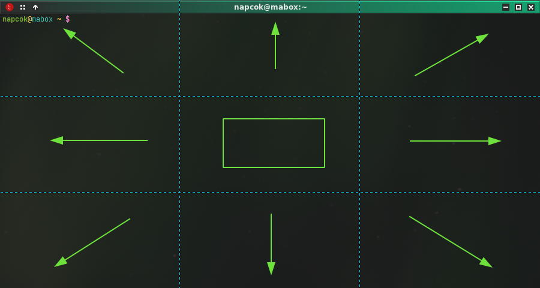

# clicksnap

clicksnap for Openbox - click on the appropriate area of the window to snap it in a given direction. 
Works with active and inactive windows.

Add this mousebind action to context Frame:

      <mousebind action="Press" button="C-Left">
        <action name="UnmaximizeFull"/>
        <action name="Execute">
          <command>clicksnap</command>
        </action>
      </mousebind>

clicksnap is binded to Ctrl + Left Mouse Click

